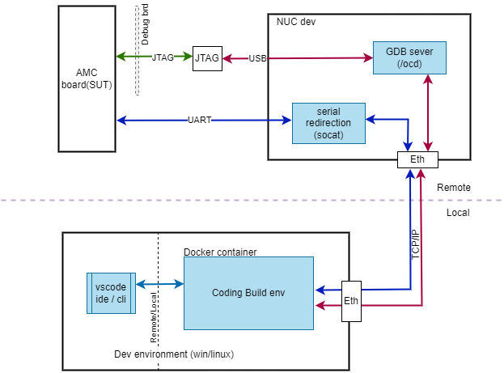
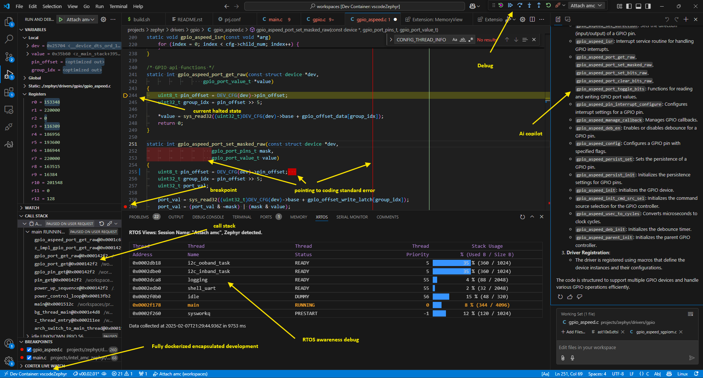

========================
AMC Dev Platform README
========================

Description
===========

This folder provides a development environment for the AMC Platform.

Prerequisites
=============

Before you begin, ensure you have met the following requirements (steps are not covered in this readme):

Linux
-----

    * Git
    * Docker
       [Can install using incluede convenient script  ``./install_packages.sh``]

Windows
-------

    * Docker Desktop
    * WSL2
    * VSCode

Download the Development Environment
====================================

Download
--------

To start the development environment, run:

Clone the repository

.. code-block:: bash

    git clone https://github.com/intel-innersource/firmware.management.amc.tools.automation.git tools_automation
    cd tools_automation/tools/amc_dev_platform/dev_env

Open the repository in VSCode
^^^^^^^^^^^^^^^^^^^^^^^^^^^^^

On Windows (Git Bash)
^^^^^^^^^^^^^^^^^^^^^
.. code-block:: bash

    cd dev_env
    code .

**OR**

On Linux/Windows 
^^^^^^^^^^^^^^^^
open ``tools/amc_dev_platform/dev_env/dev_env.code-workspace`` from file in ``VSCode`` as workspace

Reopen in Container
-------------------

Press ``F1`` and press ``Dev Container: Rebuild and Reopen in Container`` OR use click on Open in container popup on Vscode.This will open window in docker container (dev_container)

    It takes some time to download and start container. Look for your docker configuration error if struck for long time/any error.

Instruction to Use
==================

- **Initialize**
   Use `Ctrl+Shift+b` & select ``"Initialize amc repo"``

    intel repo will be downloded, west update will  complete. check code ``/workdir/PROJECTS`` folder.

- **Build**
   Use `Ctrl+Shift+b` & select ``"AMC Build"``
  
    ``PROJECTS/build`` will be having your build binaries.

- **Booting**

   - For remote serial redirection can be done by using serial redirection using tcp (optional)

       - On SUT connected host: ``sudo socat TCP-LISTEN:3345,reuseaddr,fork FILE:/dev/ttyUSB0,raw,echo=0``
           .. note::
             On Windows: Use a virtual serial port tool such as `Free Virtual Serial Ports <https://freevirtualserialports.com/>`_ to create a serial TCP server.
       
       - On Dev Machine/or inside docker container: change config.env ``SUT_PORT:3345``
       - Use `Ctrl+Shift+b` & select ``"AMC uart Boot"``  which will prompt further forfile in terminal.Follow instruction.
       - select PDU rebot if necessary during booting.

- **Debug**
   Use `Ctrl+Shift+D` & select ``"Launch/Attach AMC"`` or ``"Launch/Attach ast1030"``
    - To do J-Link debug run ``tools_automation/tools/amc_dev_platform/host_dev_tool/start_dev_tools.sh`` on dev machine connected to SUT. 

- **Note for code development & modification**
   - Use 80/120 character vertical line as reference
   - Use removal of trailing whitespace ``F1`` then ``Trim trailing whitespace``
   - Use ``Go to references`` or ``Go to Definitions`` for code navigation from right click context menu
   - If your generic vscode is ai Copilot enabled, copilot will propagate to your container also.
   - Replace ``"GDB_SERVER": "GDB_SERVER_IP:GDB_SERVER_PORT"`` in devcontainer.json with your GDB server IP and port if you want to use debugger.

The Development Environment
---------------------------

   

The J-Link Debug Environment
---------------------------

---------------------------
