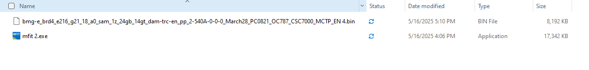
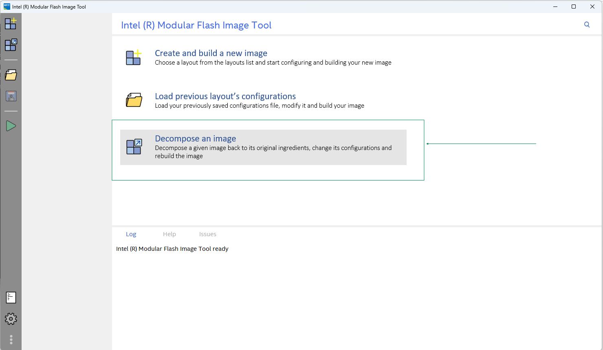
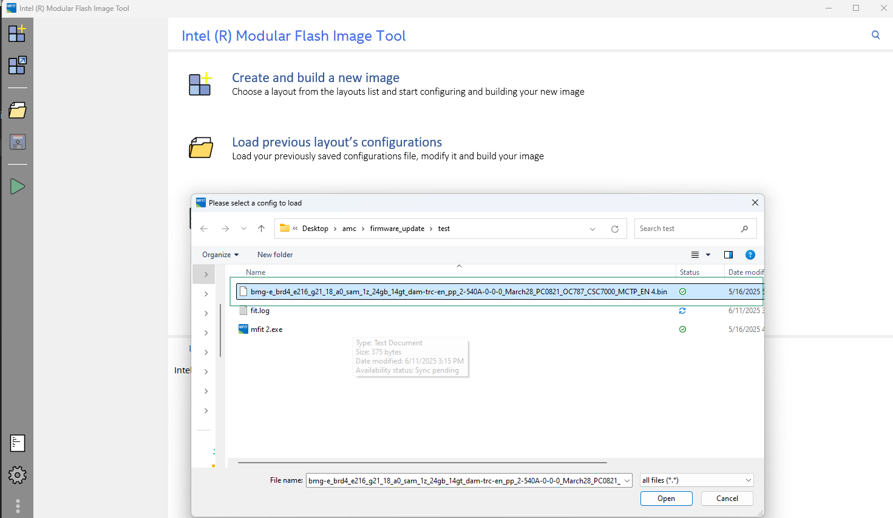
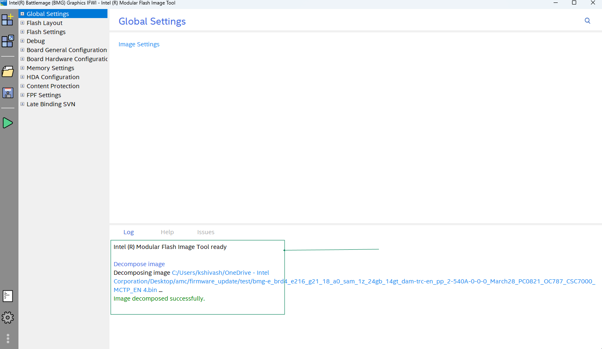
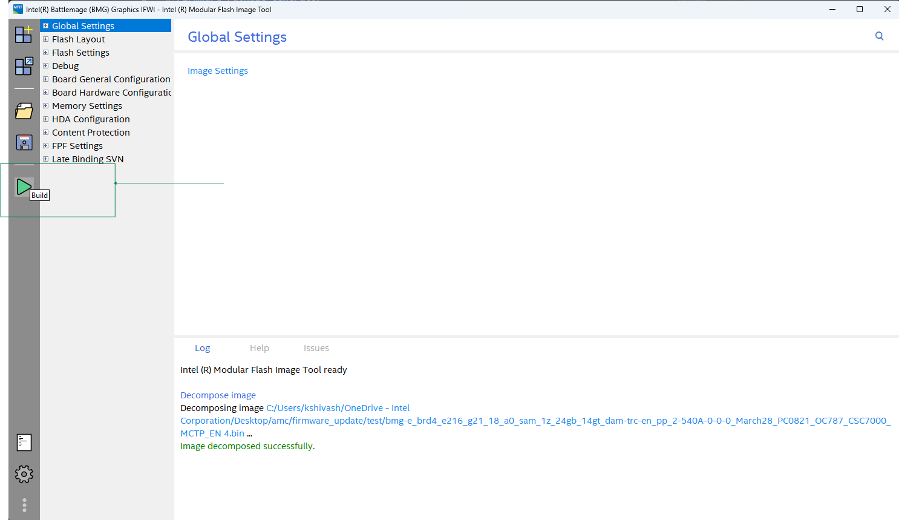
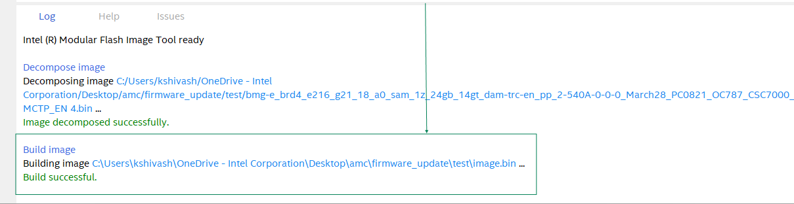
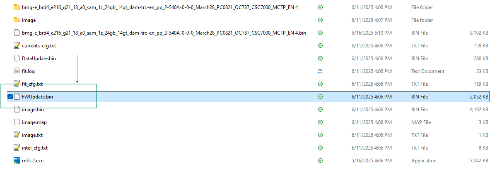

# Firmware Package Generator

This repository contains scripts to assist in generating firmware packages. Follow the instructions below to run the scripts located in the `scripts` directory.

## Prerequisites

### Ensure you have the following installed:
- Python 3.x.x

Tested Version: 3.10.12

### Input File Sources

1) AMC Bin file


2) GFX Bin file


### AMC Bin

 - Clone the `https://github.com/intel-innersource/firmware.management.amc.zephyr`
 - Follow the steps at README.md to build code and generate signed binaries.
 - Once the generate is done, signed binaries will be generated inside build/bin folder.
 - Copy the fwupdate_capsule.bin generated at build/bin as input file to generate firmware update package for AMC at path
 `firmware.management.amc.tools.automation/tools/firmware_pkg_generator/input_bins` 

### GFX Bin

Step 1: Get the ifwi binary file (.bin) and its corresponding mfit2.exe tool provided by GPU team and save it in a separate folder in a local Windows Machine.

 

Step 2: Open the mfit2.exe tool and click on `Decompose an image` option



Step 3: Select the .bin file and open




Step 4: The .bin file is decomposed as shown in the mfit log



Step 5: Click on `Build` option and check for `Build successful` log message





Step 6: The GFX binary file named `FWUpdate.bin` is generated in the folder



Step 7: Copy the `FWUpdate.bin` file to path `firmware.management.amc.tools.automation/tools/firmware_pkg_generator/input_bins`

Make sure LTCSS `csslinuxrelease-6.0.0.7-glibc-2.25 `folder is placed at below location
`firmware.management.amc.tools.automation/tools/firmware_pkg_generator/security_prerequisites`

 - Download csslinuxrelease-6.0.0.7-glibc-2.25.tgz from link below 
  https://intel.sharepoint.com/sites/ccg-ecg-amc/_layouts/15/Doc.aspx?sourcedoc={15c2c972-d908-4495-b69f-ecec575b49fa}&action=edit&wd=target%28Security.one%7Cf9c93c6d-626e-4d5a-b4de-72da8a82f056%2FLTCSS%7C8c568d75-c97c-4aed-aa75-c4de14ed6215%2F%29&wdorigin=NavigationUrl

```
  mkdir -p csslinuxrelease-6.0.0.7-glibc-2.25
  tar -xvzf csslinuxrelease-6.0.0.7-glibc-2.25.tgz -C csslinuxrelease-6.0.0.7-glibc-2.25

```
The FWUpdate.bin will signed using LTCSS.

**Note:** The public key must be copied into the `firmware.management.amc.zephyr/amc/Kconfig` file. Check if the values are present at `firmware.management.amc.zephyr/amc/Kconfig`
  - GFX_ECDSA_P384_QX
  - GFX_ECDSA_P384_QY

if the key values are not present follow step 8.

Step 8:
- The ECDSA-384 key is defined into 2 components as Qx and Qy components, each of 48 byte array as hex string. These components are essential for cryptographic verification, ensuring the integrity of signed binaries.
- The key in .pem format must be converted into Qx and Qy components for cryptographic operations.
- Refer the `secure_boot_utils.py` which has the function `extract_ecdsa_qxqy_from_pem` that reads the key from a .pem file and displays the Qx and Qy values.
- Invoke the function as below from shell. Specify absolute path to public key pem file.
This public key must correspond to the private key used to sign the GFX image.

```
python3 -c "from secure_boot_utils import extract_ecdsa_qxqy_from_pem; extract_ecdsa_qxqy_from_pem('<path_to_pem_file>')"
```
Enter the path to the pem file (absolute). QxQy values will be displayed on the screen.
- Output Format where:
    - The first 48 bytes represent Qx.
    - The next 48 bytes represent Qy.
- Update the `firmware.management.amc.zephyr/amc/Kconfig` configuration file by copying the Qx and Qy values and assigning them to the following variables respectively:
    - GFX_ECDSA_P384_QX
    - GFX_ECDSA_P384_QY

## Usage

### Step 1: Navigate to the firmware_pkg_generator Directory
Move to the `firmware_pkg_generator` directory:
```bash
cd firmware_pkg_generator
```

### Step 2: Run the Scripts to Generate Firmware Update Packages
#### Step 2.1: Run the AMC Script
Execute the `generate_amc_fw_pkg.sh` script located in the `scripts/amc` directory:
```bash
./scripts/amc/generate_amc_fw_pkg.sh
```

#### Step 2.2: Run the GFX Script
Execute the `generate_fw_pkg.sh` script located in the `scripts/binary_signing_utils` directory:
```bash
./scripts/binary_signing_utils/generate_fw_pkg.sh
```

### Step 3: Find the Version of the Tool
To check the version of the Firmware Package Generator, run any script with the `--version` flag:
```bash
./scripts/amc/generate_amc_fw_pkg.sh --version
```
or
```bash
./scripts/binary_signing_utils/generate_fw_pkg.sh --version
```

## Notes
- Ensure all input files are placed in the `input_bins` directory as required by the scripts.
- Output files will be generated in the `out_fw_pkgs` directory.

